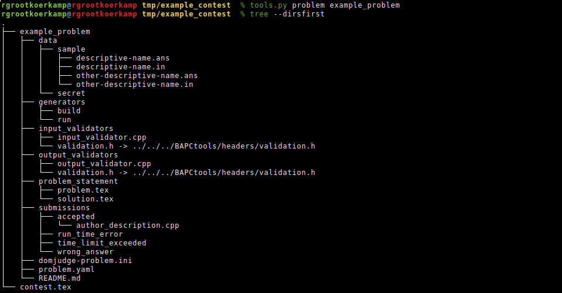
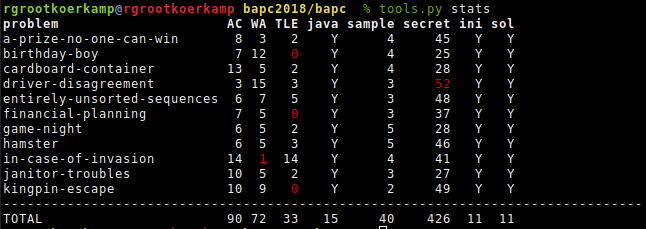

# BAPCtools

BAPCtools is a tool for creating and developing problems following the
[DomJudge/Kattis problem format](https://www.problemarchive.org/wiki/index.php/Problem_Format).

The aim of this tool is to run all necessary compilation, validation, and
testing commands while working on an ICPC-style problem.
 Ideally I should never have to manually run any compilation or testing command myself.

## Installation

For now the only way to use this is to clone the repository and install the
required dependencies manually:

-   Python 3 with the `yaml`
    [library](https://pyyaml.org/wiki/PyYAMLDocumentation) via `pip install
    pyyaml` or the `python-yaml` Arch Linux package.
-   The `argcomplete` library for command line argument completion. Install via
    `python[3]-argcomplete`.
-   The `pdflatex` command, provided by `texlive-bin` on Arch Linux.
-   Potentially some specific LaTeX packages (like tikz) provided by
    `texlive-extra`.

For Windows, you'll need the following in your
`path`:
- `Python` for Python 3
- `g++` to compile C++
- `javac` and `java` to compile and run `java`.

Note that colorized output does not work (yet?) on Windows.
Resource limits (memory limit/hard cpu time limit) are also not supported.

## Usage

The `bin/tools.py` file is the only thing you need. You can symlink it to a more
convenient location if needed. I prefer `bt` for this.

The tool can be run either from a problem directory or a contest directory. This
is automatically detected by searching for the `problem.yaml` file.

The most important subcommands it supports are (see `--help` for a few more and aliases):
* `contest`: Create a new stub contest directory.
* `problem`: Create a new stub problem directory filled with very simple example code.
* `run`: Run given or all submissions against the given or all testcases.
* `validate`, `input`, `output`: Validate input and/or output data files using a small c++-library.
	* CheckTestdata is also supported when found in the Path.
* `generate`: Use a submission to create `.ans` files for all `.in` files.
* `generate_input`: Use an input validator to generate random `.in` files.
* `constraints` searches for `const int <name> = <value>;` numeric values in the validator file and `\newcommand{<name>}{<number>}` definitions in the latex statement and prints the values side by side for easy manual verification. 
* `pdf`, `solutions`: Build a (solutions) pdf for either a problem or entire contest.
* `stats`: Print statistics on the number of testcases and submissions per problem.
* `zip`, `kattis`: Create a zip file ready for uploading to DomJudge/ready for verification by Kattis `problemtools`.
* `samplezip`: Create a zip containing all sample testcases in a contest, useful for distribution to contestant computers.

Please try the `-v` flag for more verbose output especially for `run` and `validate`.
Specify it twice to print all external compile/run/validate commands being executed.

The tool prints the first few lines of compile errors and wrong answer diffs.
`-e` enables full output and `-E` hides it completely.

What follows is a quick walk-through of some of the most important commands.

### Create a new contest

`tools.py contest example_contest`

This creates a new directory `example_contest` with a `contest.tex` file
containing metadata to put on the front page of the generated pdf.

### Create a new problem

`tools.py problem example_problem`

This create a new problem directory following the DomJudge/Kattis format.

The stub files contain the problem to read and print a single integer.

### Run submissions

From inside either a problem or contest directory: `tools.py run [-v] [-v]
[submissions] [testcases]`

This runs all submissions in the problem/contest on all testdata for the
problem. Use `-v` to make it print testcases where submissions fail.

You can also run one (or multiple) given submissions and see the status with
`-v`. Note that the wrong answer verdict is green here because the submission is
expected to get wrong answer. Unexpected outcomes are always printed, even
without `-v`. If the given and expected answer are a single line only, the diff
is given inline. Otherwise a small snippet is printed on the lines below.

### Generating output files

`tools.py generate [-f] [submission]` chooses a submission or uses the given
submission to generate a `.ans` file for every `.in` file. Supply `-f` to
overwrite changed answer files.

### Validating input/answer/output files

`tools.py validate` runs all validator files in the `input_validator` and
`output_validator` directories against all testcases.

Validators can be one of
 - an executable,
 - a c++ program,
 - a .ctd CheckTestData file (this needs the `checktestdata` executable in the
   PATH).

See the Notes on Validation section further down for more info.

### Building problem PDF

`tools.py pdf [--web]` creates a PDF of the problem statement or entire contest,
depending on where you run it. The `--web` flag removes empty pages and makes it
single sided. The output file is a `example_problem/problem.pdf` like
[this](images/problem.pdf) symlink to a build directory. (See the Notes on LaTeX
further down.)

Running it from a contest directory creates a `contest.pdf` like
[this](images/contest.pdf) file in the contest directory.

*   The problem letter and time limit are extracted from `domjudge-problem.ini`.
*   Samples are automatically included from the `data/sample` directory.
*   The `problem_statement/problem.en.tex`
    [file](skel/problem/problem_statement/problem.en.tex) consists of:
    -   `\problemname{<name>}`
    -   (optionally) a figure
    -   the problem statement
    -   an `Input` section or environment
    -   an `Output` section or environment

### Printing problem stats

`tools.py stats` print the number of AC/WA/TLE solutions, the number of
sample/secret testcases and whether the required config files are present:

## Notes on compilation

All compilation output for submissions and validators goes into a temporary
directory (in `/tmp/bapctools_xxxxxx`) created by pythons `tempfile.mkdtemp`. A
*new* directory is created for each run. Usually this directory is deleted again
when the program is finished, but it can stay around when the command is
aborted.

TODO: It would be nice to make this directory persistent between runs to prevent
recompilation when only testdata changed.

## Notes on LaTeX

LaTeX files are compiled using `pdflatex`. If it does not exist a build
directory is created at `./latex/build` inside this repository. (This should
probably be changed to something nicer.) This is done using `tempfile.mkdtemp`
to create a new directory in `/tmp/bapctools_latex_xxxxxxx` (if supported) and
next it is symlinked to `./latex/build`.

The benefit of this approach is that all compilation happens in memory which is
slightly faster (and saves disk writes). Since the build directory is preserved
between runs (but not between reboots) re-running the build of a problem/contest
pdf will be faster as usual.

The tool *does not* call `pdflatex` multiple times so it is recommended to run
`tools.py pdf` multiple times to fix the table of contents and references to
images.

### Build structure

[latex/readme.md](latex/readme.md) has more detailed information on the steps
taken to compile a problem/contest pdf. A quick overview:

-   [latex/problem.tex](latex/problem.tex) is the root latex file that will be
    compiled. It has the `bapc` documentclass which contains most style info.
    This file includes three files:
-   `build/problem/problemid.tex`: a file generated by `tools.py` setting the
    section counter to the right offset (for problem `A`, `B`, ...) and a
    variable indicating the timelimit extracted from the config files.
-   The problem statement `problem_statement/problem.en.tex`
-   `samples.tex`, a programmatically generated file containing tables of all
    sample input and output. We use somewhat hacky code to escape most asci into
    printable latex monospace characters.

Contests are build in a similar way: - The `contest.tex` and `logo.pdf` files
are symlinked into the `build/contest` directory. - A
`build/contest/problems.tex` file is created which for each problem includes the
three files mentioned before. - The `latex/contest.tex` file is compiled, which
includes the contest metadata file and the list of problems.

Note that to keep the latex code a bit simpler, we create a new directory for
each problem/contest, but symlink it to 'problem' or 'contest' so that the exact
location of the relevant files is known.

### TikZ pictures

[headers/tikz.h](./headers/tikz.h) is a small helper class for writing TikZ
pictures from a list of points. This can be used to create images of input and
output of testcases.

## Notes on validation

We use our own small C++ validator library
[headers/validation.h](./headers/validation.h) to validate: - test input - test
answers - team output.

An `InputValidator` is always both whitespace sensitive and case sensitive, and
reads from `stdin`. It will be called as `./input_validator < testcase.in`. The
InputValidator should then be used for all reading, see
[skel/problem/input_validators/input_validator.cpp](skel/problem/input_validators/input_validator.cpp).

The `OutputValidator` (e.g.
[skel/problem/output_validators/output_validator.cpp](skel/problem/output_validators/output_validator.cpp))
should be passed the commandline arguments of the main program itself. It looks
for the `case_sensitive` and `space_change_sensitive` flags to decide the mode.
It will be called in strict mode when testing jury-provided `.ans` files, but
will run in permissive mode when validating team output (in case the problem
needs custom validation, as specified in
[problem.yaml](skel/problem/problem.yaml)). Again it binds to `stdin` to read
input in strict mode.

TODO: The `float_tolerance` flags are not yet supported in custom validation
mode, though they do work with the default validator build into `tools.py`
itself.

TODO: We should support `.ans` validator even for 'custom' validator type.

The output validator will be called as `./output_validator testcase.in
testcase.ans output_dir [flags] < team_output.out`.

For simple `.ans` validation it is sufficient to read the `.in` file specified
as the first argument for important variables and then use the OutputValidator
for parsing the answer file that will be provided to stdin.

For custom validation, the code can read the input from `argv[1]`, the answer
from `argv[2]` and the OutputValidator will still bind to the team output on
`stdin`.
