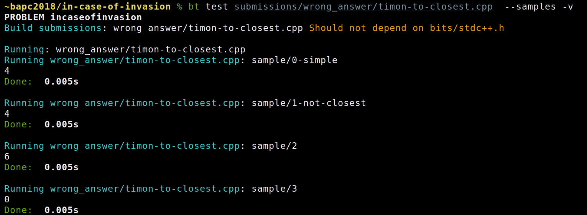
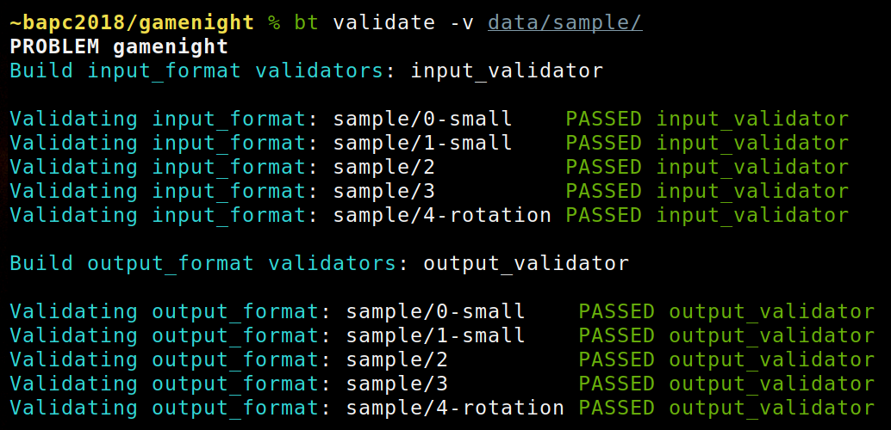

# BAPCtools

BAPCtools is a tool for creating and developing problems following the CLICS (DOMjudge/Kattis) problem format specified [here](https://icpc.io/problem-package-format/spec/2025-09.html).

The aim of this tool is to run all necessary compilation, validation, and testing commands while working on an ICPC-style problem.
Ideally, one should never have to manually run any compilation or testing command themselves.

We are always interested to know who's using this, so feel free to inform us (e.g. via an issue) if so :)
The main user base is sitting in Europe with regular users from the BAPC, GCPC and NWERC.
BAPCtools has also been used to prepare problems at the EUC and the ICPC WF.

## Installation

> [!IMPORTANT]
> The latest version of BAPCtools is designed for the lasted version of the problem format: [`2025-09`](https://icpc.io/problem-package-format/spec/2025-09.html).
> The [`bt upgrade` command](https://github.com/RagnarGrootKoerkamp/BAPCtools/blob/HEAD/doc/commands.md#upgrade) is a best-effort automated way to upgrade older packages to `2025-09`.
> If you are working on older packages, we recommend to upgrade them.
> If you do not want this, you can also switch to the [`legacy` branch](https://github.com/RagnarGrootKoerkamp/BAPCtools/tree/legacy).
> However, keep in mind that this version is no longer actively maintained.

There are multiple ways to install BAPCtools:
- From [PyPI](https://pypi.org/p/bapctools/): `pip(x) install bapctools`.
  This should be a complete installation (including all dependencies and a `bt` executable) and should work on any Linux-ish system.
- The [bapctools-git AUR package](https://aur.archlinux.org/packages/bapctools-git/),
  mirrored [here](https://github.com/RagnarGrootKoerkamp/bapctools-git).
- Run from a [Docker image](#Docker).
- The development version from git via `pip install .`.
  For more information regarding the development version see the installation instructions [at the end of this file](#Developing--Contributing-to-BAPCtools).

(If you know how to make a Debian package, feel free to help out.)

### Windows
> [!IMPORTANT]
> For Windows, the preferred way to use BAPCtools is inside the Windows Subsystem for Linux (WSL).

Note that BAPCtools makes use of symlinks for building programs.
By default, users are not allowed to create symlinks on Windows.
This can be fixed by enabling Developer Mode on Windows (only since Windows 10 version 1703, or newer).<br>
In case you're still having problems with symlinks in combination with Git after enabling this setting, please try the suggestions at https://stackoverflow.com/a/59761201.
Specifically, `git config -g core.symlinks true` should do the trick, after which you can restore broken symlinks using `git checkout -- path/to/symlink`.

### Native Windows
If you cannot or do not want to use WSL, you'll need the following in your `%PATH%`:

- `python` for Python 3
- `g++` to compile C++
- `javac` and `java` to compile and run Java.
- `pyctd` for checktestdata, see [PyCTD](https://github.com/mzuenni/pyctd)

> [!IMPORTANT]
> Some features do not work on native windows:
> - Resource limits like memory limit/hard cpu time limit...
> - Core pinning
> - argparse auto completion
> - Logging interactions for interactive problems
> - maybe more
Resource limits (memory limit/hard cpu time limit) are not supported.

### Docker

A docker image containing this git repo and dependencies, together with commonly used languages, is provided at [ragnargrootkoerkamp/bapctools](https://hub.docker.com/r/ragnargrootkoerkamp/bapctools).
This version may be somewhat outdated, but we intend to update it whenever dependencies change.
Ping us if you'd like it to be updated.
Alternatively, inside the Docker container, you can run `git -C /opt/BAPCtools pull` to update to the latest version of BAPCtools, and use `pacman -Sy <package>` to install potential missing dependencies.
<!-- TODO: update the Docker image to use installation via Pip. -->

This image can be used for e.g.:

- running CI on your repo.
  Also see `bt gitlabci` which generates a `.gitlab-ci.yaml` file.
  Make sure to clear the entrypoint, e.g. `entrypoint: [""]`.
- running `bt` on your local problems.
  Use this command to mount your local directory into the docker image and run a command on it:
  ```
  docker run -v $PWD:/data --rm -it ragnargrootkoerkamp/bapctools <bt subcommands>
  ```

## Common Usage

> [!CAUTION]
> Do not use BAPCtools on problem packages from untrusted sources.
> Programs are **not** run inside a sandbox.
> Malicious submissions, validators, visualizers, and generators can harm your system.

BAPCtools can be run either from a problem directory or a contest directory.
This is automatically detected by searching for the `problem.yaml` file.

The most common commands and options to use on an existing repository are:

- [`bt run [-v] [submissions [submissions ...]] [test_cases [test_cases ...]]`](#run)
- [`bt test <submission> [--interactive | --samples | [test_cases [test_cases ...]]]`](#test)
- [`bt generate [-v] [--jobs JOBS]`](#generate)
- [`bt validate [-v] [--input | --answer] [--remove | --move-to DIR] [test_cases [test_cases ...]]`](#validate)
- [`bt pdf [-v]`](#pdf)

A guide on how to set a problem with BAPCtools and what commands to use can be found at [doc/workflow.md#synopsis](doc/workflow.md#).
The list of all available commands and options is at [doc/commands.md#synopsis](doc/commands.md#synopsis).
Additionally, information regarding the implementation is at [doc/implementation_notes.md](doc/implementation_notes.md).

### Run

- `bt run [-v] [submissions [submissions ...]] [test_cases [test_cases ...]]`

Without arguments, the `run` command runs all submissions against all test cases.
Specify one or more submissions and one or more test cases to only run the given submissions against the given test cases.

Before running the given submissions, this command first makes sure that all generated test cases are up to date (in case `generators/generators.yaml` was found).
To disable automatically regenerating test cases, pass `-G` (`--no-generate`), or add `no_generate: true` to a `.bapctools.yaml` file in the problem or contest directory.


By default, `bt run` only prints one summary line per submission, and one additional line for each test case with an unexpected result. Use `-v` to print one line per test case instead.


### Test

- `bt test <submission> [--samples | [test_cases [test_cases ...]]]`

Use the `test` command to run a single submission on some test cases.
The submission `stdout` and `stderr` are printed to the terminal instead of being verified as an answer file.
Use `--samples` to run on the samples, or pass a list of test cases or directories containing test cases.
Use `--interactive`/`-i` to run in interactive mode, where console input is forwarded to the submission.
This rebuilds and reruns the program until either `control-C` or `control-D` is pressed.
It's also possible to supply the test case on the command line directly using e.g. `< /path/to/file.in` or `<<< "10 20"`.



### Generate

- `bt generate [-v] [--jobs JOBS]`

Use the `generate` command to generate the test cases specified in `generators/generators.yaml`.
See [doc/generators.md](doc/generators.md) for the specification of `generators.yaml` and see [doc/commands.md#generate](doc/commands.md#generate) for the full list of arguents.
Use `-j 0` to disable running multiple jobs in parallel (the default is half of the available cpu cores).


### Validate

- `bt validate [-v] [--input | --answer] [--remove | --move-to DIR] [test_cases [test_cases ...]]`

Validate all the `.in` and `.ans` for all (given) test cases.
It runs all validators from `input_validators`, `answer_validators`, and `output_validators`.

Validators can be one of

- a single-file program.
- a multi-file program with all files in a common directory.
- a .ctd CheckTestData file (this needs the `pyctd` executable in your `$PATH`, see [PyCTD](https://github.com/mzuenni/pyctd)).
- a .viva file.

You can use `--remove` to delete all failing test cases or `--move <dir>` to move them to a separate directory.



### Pdf

- `bt pdf [-v] [--cp]`

Use this command to compile the `problem.en.pdf` from the `statement/problem.en.tex` LaTeX statement.
The generated `problem.en.pdf` is linked to the problem directory itself, if you want a persistent version of the pdf use `--cp`.

This can also be used to create the contest pdf by running it from the contest directory.

## Personal configuration file

For some command-line flags, it is convenient if they are always set to the same value, which differs per user (e.g., `--username` or `--password` for commands that access a CCS like DOMjudge) or per contest (e.g., which statement languages are used).
For this, you can create a configuration YAML file containing key-value pairs in one of the following locations, from low to high priority:

- `$XDG_CONFIG_HOME/bapctools/config.yaml` (Unix-ish systems, where `$XDG_CONFIG_HOME` usually is `~/.config`)
- `%AppData%/bapctools/config.yaml` (Windows systems)
- `<contest directory>/.bapctools.yaml`

The keys in this config file can be any option that can be passed on the command-line.
Note that the keys should be written out in full (e.g., `username: jury` rather than `u: jury`) and any hyphens should be replaced with an underscore (e.g., `no_bar: True` rather than `no-bar: True`).

These personal config files also allow you to set the key `local_time_multiplier` to adjust hardcoded time limits intended for different hardware.
This might be useful for the CI or if your hardware is much faster or much slower than the contest hardware.

## Developing / Contributing to BAPCtools

The recommended way to install all development dependencies is in a virtual environment,
created with `python3 -m venv venv` and activated with `. venv/bin/activate`.<br />
Install the development dependencies with `pip install --editable . --group dev`.

If you want to use your local development version of BAPCtools anywhere, you can create a symlink from any `bin` directory on your `$PATH` to the virtual environment, for example: `ln -s /path/to/BAPCtools/venv/bin/bt ~/bin/bt`.

The Python code in the repository is formatted using [Ruff](https://github.com/astral-sh/ruff) and type-checked using [mypy](https://mypy-lang.org/).
To enable the pre-commit hook, run `pre-commit install` from the repository root.
All Python code will now automatically be formatted and type-checked on each commit.
If you want to run the hooks before creating a commit, use `pre-commit run` (only staged files) or `pre-commit run -a` (all files).

## Updating the Docker Image

This can only be done by maintainers:

```
$ sudo systemctl start docker
$ docker pull archlinux:latest
$ docker login
$ docker build . -t ragnargrootkoerkamp/bapctools
$ docker push ragnargrootkoerkamp/bapctools
$ ssh <server> sudo docker pull ragnargrootkoerkamp/bapctools
```

The last step is needed when your CI server is not automatically pulling the latest version.
